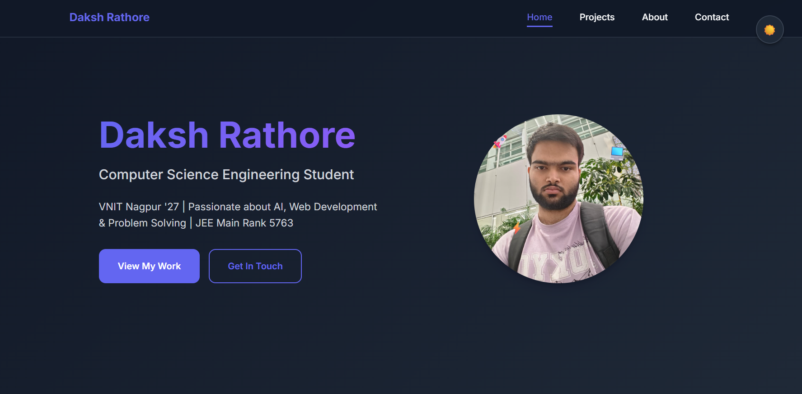

# 🌐 My Personal Developer Portfolio

This is the complete source code for my **personal developer portfolio website**, built from scratch to showcase my **projects, skills, and experience**.

It’s created using **vanilla HTML, CSS, and JavaScript**, demonstrating modern web development practices **without relying on large frameworks**. All portfolio content (projects, skills, and education) is dynamically loaded from a single `portfolio-data.json` file, making the site super easy to update.

---

## 🚀 Live Demo

🔗 **View Live:** https://d4a1k11s19h8.github.io/portfolio-website/


---

## 🖼️ Screenshot



---

## ✨ Key Features

- **🎨 Fully Responsive Design:** Optimized for all devices — mobile, tablet, and desktop.  
- **🌙 Dark Mode:** Supports both manual toggle and system preferences (`prefers-color-scheme`).  
- **📁 Data-Driven Content:** Content (projects, skills, education) loaded dynamically from `portfolio-data.json`.  
- **🧩 Project Filtering:** Filter projects by categories (AI/ML, Web Dev, etc.).  
- **💡 Code Snippet Modal:** View highlighted code snippets directly within the site.  
- **📬 Working Contact Form:** Integrated with **Formspree** for secure email submissions.  
- **⚡ Modern JavaScript:** Uses ES6+ features — classes, `async/await`, and the Fetch API.  
- **🎞️ Scroll Animations:** Smooth fade-in effects using the IntersectionObserver API.  

---

## 🧰 Tech Stack

| Area | Technologies Used |
|------|--------------------|
| **Frontend** | HTML5, CSS3 (with CSS Variables) |
| **Scripting** | Vanilla JavaScript (ES6+), Fetch API |
| **Animations** | IntersectionObserver API |
| **Contact Backend** | [Formspree](https://formspree.io) |
| **Data Source** | JSON |
| **Syntax Highlighting** | [highlight.js](https://highlightjs.org/) |

---

## ⚙️ Getting Started

To properly load JSON data, the project must run on a **local server**.  
Opening the `index.html` file directly (via `file:///`) will trigger a **CORS error**.

### ✅ Prerequisites

- A **modern web browser**  
- A **local web server** (e.g., Live Server in VS Code)

---

### ▶️ Running Locally

1. **Clone the repository**
   ```bash
   git clone https://github.com/d4a1k11s19h8/portfolio-website.git
   ```
2. **Navigate to the project directory**
   ```bash
   cd portfolio-website
   ```

3. **Run with Live Server (Recommended)**  
   - Install the **Live Server** extension in VS Code  
   - Right-click `index.html` → “Open with Live Server”

4. **Or Run with Python (Alternative)**
   ```bash
   python -m http.server
   ```
   Then open [http://localhost:8000](http://localhost:8000) in your browser.

---

## ⚙️ Configuration

### 📬 Setting up Formspree (for the Contact Form)

1. Go to [Formspree.io](https://formspree.io) and **create an account**.  
2. Set up a new form — you’ll get a **unique endpoint URL**, e.g.:
   ```
   https://formspree.io/f/yourformid
   ```
3. In your project, open `contact.html` and **replace** the placeholder Formspree URL (around line 121) with your own.

---

## 🧱 Project Structure

```
📁 portfolio/
├── 📄 index.html
├── 📄 about.html
├── 📄 projects.html
├── 📄 contact.html
├── 📁 assets/
│   ├── 📁 css/
│   ├── 📁 js/
│   └── 📁 images/
├── 📄 portfolio-data.json
└── 📄 README.md
```

---

## 🧠 Future Improvements

- Add project detail pages with case studies.  
- Integrate Google Analytics for visitor tracking.  
- Add a blog section powered by Markdown or a headless CMS.  

---

## 🧑‍💻 Author

**[Your Name]**  
🌐 [Your Portfolio Link](https://d4a1k11s19h8.github.io/portfolio-website/)  
💼 [LinkedIn](https://linkedin.com/in/rathoredaksh2004) | 🐙 [GitHub](https://github.com/d4a1k11s19h8)

---

## 📄 License

This project is licensed under the **MIT License** — see the [LICENSE](LICENSE) file for details.
